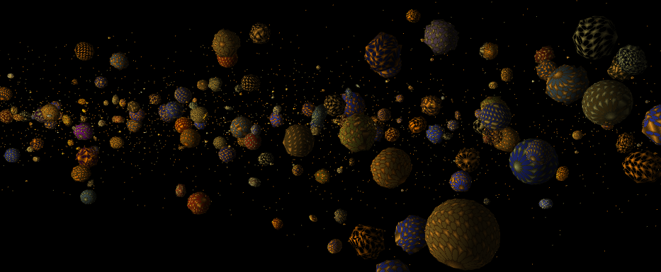
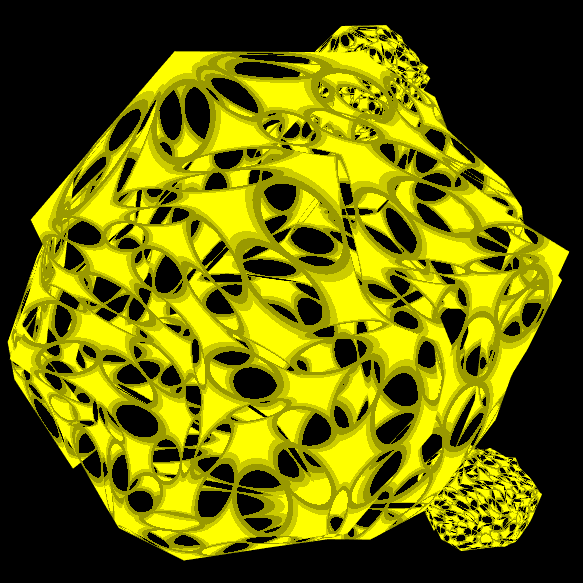

# AsteroidaGraphica
## About
--------------------

*12/29 Status Update*

*12/14 Status Update*

AsteroidaGraphica is (being created) to be a essentially-infinite-world, futuristic, adventure and role-playing asteroid mining simulator.
*This project is in progress; more details will be added when closer to completion*

## Status
-------------------
### HIBERNATING 

Work on [agow] (https://github.com/GuMiner/agow) has caused this project to be hibernated until a more compelling game design can be created.

## Build
--------
This project requires the listed **Referenced Libraries** below, in addition to (separately distributed) asset files.

## Referenced Libraries
---------------------
*Full attribution details to be included when this project is made publicly available*
* glBinding
* SFML
* STB
